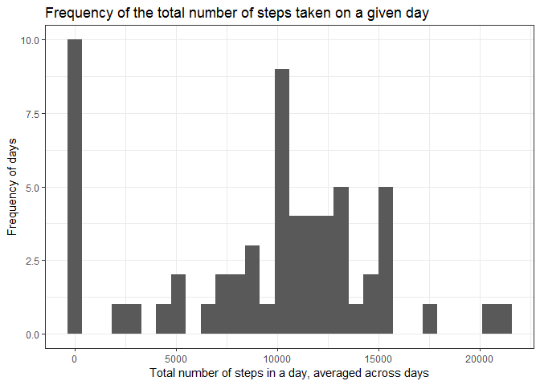
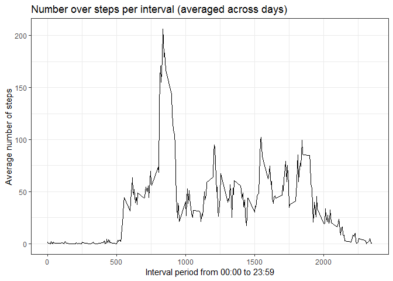
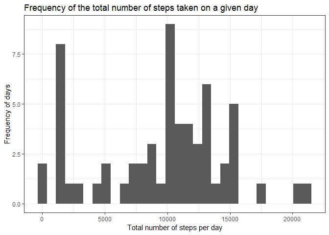
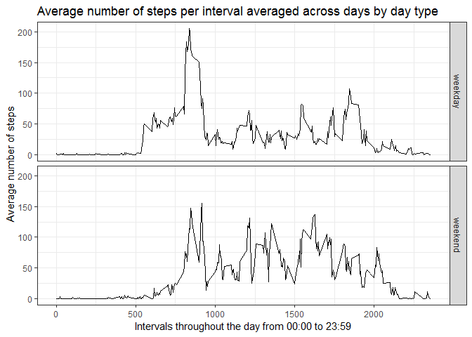

## Loading the data

First we will load the relevant libraries for this project:

```r
library(ggplot2)
library(plyr)
library(dplyr)
```

```
## Warning: package 'dplyr' was built under R version 3.5.3
```

```
## 
## Attaching package: 'dplyr'
```

```
## The following objects are masked from 'package:plyr':
## 
##     arrange, count, desc, failwith, id, mutate, rename, summarise,
##     summarize
```

```
## The following objects are masked from 'package:stats':
## 
##     filter, lag
```

```
## The following objects are masked from 'package:base':
## 
##     intersect, setdiff, setequal, union
```

```r
library(knitr)
```

```
## Warning: package 'knitr' was built under R version 3.5.3
```


These chunks of code will download the zip file from the URL provided, if it is not already in the working directory, print out the date the file was downloaded, unzip the file, and store the data from the CSV file into a relevant object.


```r
if(!file.exists("activity.zip")){
    
    fileURL <- "https://d396qusza40orc.cloudfront.net/repdata%2Fdata%2Factivity.zip"
    
    download.file(fileURL, destfile = "RepData_Peer1Data.zip")
}

dateDownloaded <- date()
print(dateDownloaded)
```

```
## [1] "Mon May 25 20:13:59 2020"
```

```r
unzip("activity.zip", exdir = ".")

actData <- read.csv("activity.csv")
```

The zip file used when this report was written was downloaded on:
"Mon May 25 12:48:06 2020"

## What is the mean total number of steps taken per day?

Missing values will be ignored in this part of the assignment.


```r
byDate <- group_by(actData, date)


byDateSteps <- summarise(byDate, 
                         dailySteps = sum(steps, na.rm = TRUE))

gDailySteps <- ggplot(byDateSteps,
                      aes(x = dailySteps))
gDailySteps+
  geom_histogram()+
  theme_bw()+
  labs(title = "Frequency of the total number of steps taken on a given day", 
       x = "Total number of steps in a day, averaged across days", 
       y = "Frequency of days")
```

```
## `stat_bin()` using `bins = 30`. Pick better value with `binwidth`.
```

<!-- -->


```r
mean(byDateSteps$dailySteps)
```

```
## [1] 9354.23
```

```r
median(byDateSteps$dailySteps)
```

```
## [1] 10395
```

The mean for the total number of steps averaged across all days is 9354.23, rounded to 9354 to the nearest step.
The median for the total number of steps averaged across all days is 10395.

## What is the daily average pattern?


```r
byInterval <- group_by(actData, interval)


byIntervalSteps <- summarise(byInterval,
                             intervalSteps = mean(steps, na.rm = TRUE))

gIntSteps <- ggplot(byIntervalSteps,
                    aes(x = interval,
                        y = intervalSteps))

gIntSteps+geom_line()+
  theme_bw()+
  labs(title = "Number over steps per interval (averaged across days)",
       x = "Interval period from 00:00 to 23:59",
       y = "Average number of steps")
```

<!-- -->

Locating the interval that on average contains the maximum value:

```r
byIntervalSteps[which(byIntervalSteps$intervalSteps == max(byIntervalSteps$intervalSteps)),]
```

```
## # A tibble: 1 x 2
##   interval intervalSteps
##      <int>         <dbl>
## 1      835          206.
```

Interval 835 had the largest mean number of steps averaged across all days. This was 206 steps (rounded to the nearest whole number). Missing variables (coded NA) have been ignored.

## Imputing missing variables


```r
sum(is.na(actData$steps))
```

```
## [1] 2304
```

The total number of missing variables in this data set is 2304.

We will use the median number of steps for each interval to impute these missing values.


```r
# Locate rows with NA
findNA <- which(is.na(actData))
actData[findNA, ]
```


```r
# Calculate the average median value across all days
intMedian <- summarise(byInterval,
                       intervalSteps = median(steps, na.rm = TRUE))

# Create a data frame to replace the NA with median values
impData <- actData %>%
              left_join(intMedian, by = c("interval"))


impData$steps <- ifelse(is.na(impData$steps), 
                        impData$intervalSteps,
                        impData$steps)


impbyDateSteps <- group_by(impData, date) %>%
                  summarise(dailySteps = sum(steps, na.rm = TRUE))


# Plot a histogram
gimpData <- ggplot(impbyDateSteps,
                   aes(x = dailySteps))

gimpData+
  geom_histogram()+
  theme_bw()+
  labs(title = "Frequency of the total number of steps taken on a given day", 
       x = "Total number of steps per day", 
       y = "Frequency of days")
```

```
## `stat_bin()` using `bins = 30`. Pick better value with `binwidth`.
```

<!-- -->

Calculating the mean and the median for this new dataset:


```r
mean(impbyDateSteps$dailySteps)
```

```
## [1] 9503.869
```

```r
median(impbyDateSteps$dailySteps)
```

```
## [1] 10395
```

After imputing values to replace the NA, the mean number of total steps averaged across all days has increased from 9354.23 to 9503.869 steps. The new mean is 9504 rounded to the nearest step.

The median value has remained the same across both datasets, at 10395.

## Are there differences in activity patterns between weekdays and weekends?


```r
impData <- mutate(impData,
                  weekday = weekdays(as.Date(impData$date, "%Y-%m-%d")))

impData <- mutate(impData,
                  daytype = 
                    ifelse(impData$weekday %in% c("Saturday", "Sunday"),
                           "weekend", 
                           "weekday"))

# Find the average number of steps across days
impbyDayType <- group_by(impData, interval, daytype)

impbyDayTypeSteps <- summarise(impbyDayType,
                               intervalSteps = mean(steps, na.rm = TRUE))


# Create line plots
gimpData <- ggplot(impbyDayTypeSteps,
                   aes(x = interval,
                       y = intervalSteps))

gimpData+
  geom_line()+
  facet_grid(rows = vars(daytype))+
  labs(title = "Average number of steps per interval averaged across days by day type",
       x = "Intervals throughout the day from 00:00 to 23:59",
       y = "Average number of steps")+
  theme_bw()
```

<!-- -->

The graphs presented suggest that during weekdays the number of steps quickly increases from 0 soon after the 500 interval mark, quickly reaching approximately 50 steps per interval. In comparison, during the weekends this increase is much more gradual, only reaching 50 steps per interval after the 750 interval mark.

The maximum number of steps in a given interval is also higher for the average weekday than for the average weekend, exceeding 200 steps in a given interval. During the weekend, the number of steps crosses 150 steps per interval, on average, but does not reach 175.

However, throughout the period from the 1000 interval mark until the 2000 interval mark, the number of steps per interval during the average weekend day is almost always between 25 steps per interval and 100 steps per interval. Over the same period during the weekday the number of steps per interval does reach 100 on one occassion, but is usually osscilating between 0 and 75, suggesting a lower range in the number of steps for this time period.

The final decline near the end of the day appears to occur earlier during the weekdays than the weekends, on average. During the weekdays, a decline occurs between the intervals for 1750 and 2000, with only a few minor spikes before resting at or near 0 steps per interval. For the weekend in contrast, the number of steps per interval only has a noticeable decline after the 2000 interval mark, suggesting much more activity later in the night.
